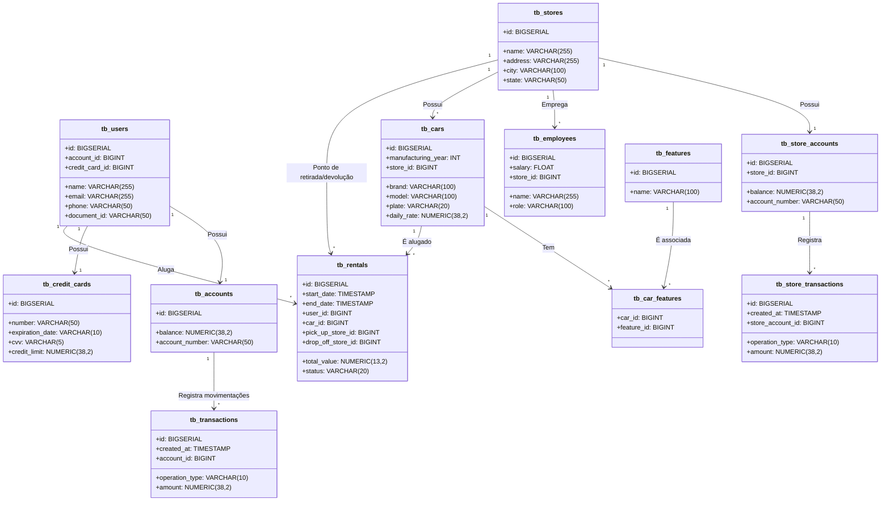

# Primeiro projeto - API JAVA SPRING BOOT 

Este repositório contém o código-fonte do primeiro projeto do DIO Decola Tech 2025, desenvolvido em Java com Spring Boot, utilizando Spring JPA para persistência e PostgreSQL como banco de dados. A aplicação está configurada para ser implantada (deploy) na plataforma Railway, proporcionando uma solução em nuvem simples de gerenciar.

---

# 📌 Principais Tecnologias

## 🚀 **Backend**
- **Java 17**: Utilizamos a versão LTS mais recente do Java para garantir **desempenho, segurança e compatibilidade** com as melhores práticas do mercado.
- **Spring Boot 3**: Framework que facilita o desenvolvimento de aplicações Java, **maximizando a produtividade** com **autoconfiguração** e **boas práticas embutidas**.
- **Spring Data JPA**: Simplifica a **camada de persistência**, reduzindo a complexidade do acesso ao banco de dados e otimizando as operações com **PostgreSQL**.
- **Hibernate**: Framework ORM que facilita a comunicação com o banco de dados, convertendo objetos Java em **entidades relacionais**.

## 📊 **Banco de Dados**
- **PostgreSQL**: Banco de dados **robusto, escalável e confiável**, utilizado para armazenar os dados do sistema de maneira eficiente e segura.
- **H2 Database** (ambiente de desenvolvimento): Banco de dados **em memória**, utilizado para facilitar testes e desenvolvimento local.

## 📡 **Infraestrutura & Deploy**
- **Railway**: Plataforma que facilita o **deploy automatizado**, fornecendo infraestrutura escalável e suporte a **bancos de dados gerenciados**.
- **Docker**: Ferramenta para **containerização**, garantindo que o ambiente da aplicação seja o mesmo em **desenvolvimento, teste e produção**.

## 📜 **Documentação**
- **OpenAPI (Swagger)**: Utilizado para **gerar a documentação da API**, facilitando a integração com outras aplicações e fornecendo um visual interativo para **testes e explorações**.

## ✅ **Qualidade e Segurança**
- **Flyway**: Ferramenta para **controle de versionamento do banco de dados**, garantindo que as **migrations** sejam aplicadas corretamente.
- **Spring Security (futuro)**: Planejado para implementar **autenticação e autorização** de forma segura.
- **Testes Unitários & Integração**: A implementação de testes automatizados ajudará a **garantir a qualidade do código e prevenir falhas**.

---

# Diagrama de Classe do Modelo ER do Banco

# Descrição do Modelo ER

O sistema representa um **serviço de aluguel de carros** e sua **gestão financeira**. Aqui está uma explicação de como cada entidade se relaciona:

## Usuários (`tb_users`)

- Cada usuário tem um **documento único** (`document_id`), **telefone** e **e-mail**.
- Um usuário pode possuir **uma conta** (`tb_accounts`) para transações financeiras e um **cartão de crédito** (`tb_credit_cards`).

## Contas (`tb_accounts`) e Transações (`tb_transactions`)

- Cada conta tem um **saldo** (`balance`) e um **número de conta** (`account_number`).
- As transações registram **movimentações financeiras** da conta do usuário, podendo ser de **crédito ou débito**.

## Lojas (`tb_stores`) e Funcionários (`tb_employees`)

- Uma loja pode ter **vários funcionários** (`tb_employees`) com **diferentes cargos e salários**.
- Cada loja tem um **endereço, cidade e estado**.

## Carros (`tb_cars`) e Recursos (`tb_features`)

- Cada loja pode ter **vários carros para aluguel**.
- Os carros possuem **marca, modelo, ano de fabricação, placa e preço da diária** (`daily_rate`).
- Cada carro pode ter **diferentes características** (`tb_features`), como **ar-condicionado, câmbio automático**, etc.

## Locações (`tb_rentals`)

Os usuários podem alugar carros, e cada aluguel tem:

- **Data de início** (`start_date`) e **fim** (`end_date`).
- **Valor total** (`total_value`) e **status** (**aberto** ou **finalizado**).
- **Loja de retirada** (`pick_up_store_id`) e **devolução** (`drop_off_store_id`).

## Contas das Lojas (`tb_store_accounts`) e Transações (`tb_store_transactions`)

- Cada loja tem **uma conta bancária** (`tb_store_accounts`) com saldo.
- As transações registram os **créditos/débitos** relacionados ao funcionamento da loja.

---

# 📄 **Documentação da API (Swagger)**  
🔗 [Acesse a documentação da API aqui](https://decola-tech-2025-projeto-01-api-production.up.railway.app/swagger-ui/index.html)  

Esta API ficará disponível no **Railway** por um período de tempo limitado. No entanto, este é um **código-fonte aberto**, então sintam-se à vontade para **cloná-lo, modificá-lo e utilizá-lo** como base para seus próprios projetos! 🚀  

